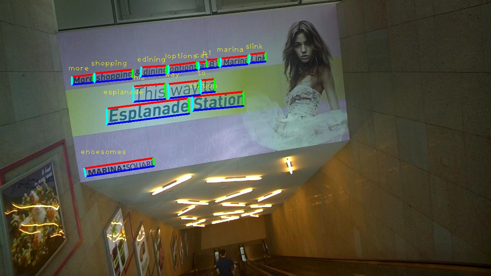
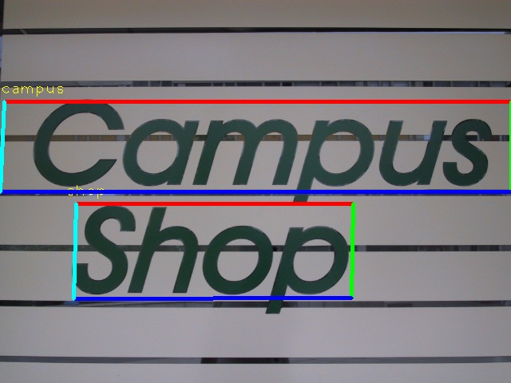
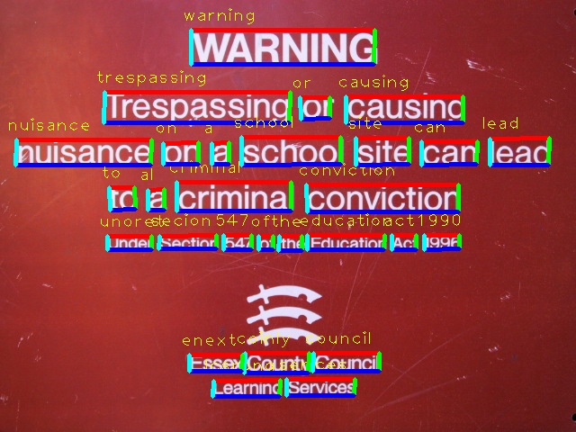
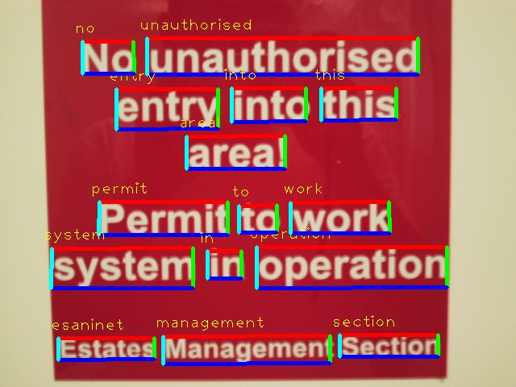
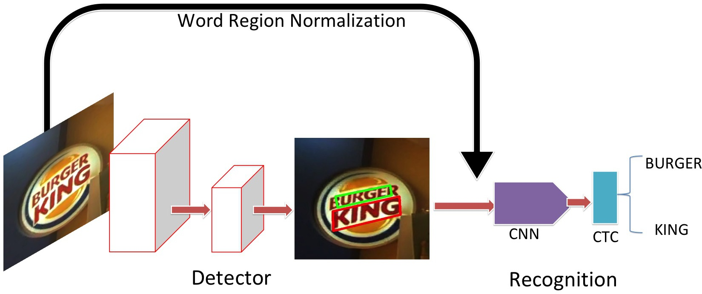

# DeepSceneTextReader
This is a c++ project deploying a deep scene text reading pipeline. It reads text from natural scene images.

  
  
  
  

# Prerequsites

The project is written in c++ using tensorflow computational framework. It is tested using tensorflow 1.4. Newer version should be ok too, but not tested.
Please install:

* Tensorflow

* nsync project: https://github.com/google/nsync.git  This is needed for building tensorflow.

* opencv3.3

* protobuf

* eigen

Please check this project on how to build project using tensorflow with cmake:
https://github.com/cjweeks/tensorflow-cmake
It greatly helped the progress of building this project.
When building tensorflow library, please be careful since we need to use opencv. Looks like there is still problem when including tensorflow and opencv together.
It will make opencv unable to read image.
Check out this issue: https://github.com/tensorflow/tensorflow/issues/14267
The answer by allenlavoie solved my problem, so I paste it here:

"In the meantime, as long as you're not using any custom ops you can build libtensorflow_cc.so with bazel build --config=monolithic, which will condense everything together into one shared object (no libtensorflow_framework dependence) and seal off non-TensorFlow symbols. That shared object will have protocol buffer symbols."

# Status
Currently two pretrained model is provided. One for scene text detection, and one for scene text recognition.
More model will be provided.
Note that the current model is not so robust. U can easily change to ur trained model.
The models will be continuously updated.

# build process

cd build

cmake ..

make

It will create an excutable named **DetectText** in bin folder.

# Usage:
The excutable could be excuted in three modes:  (1) Detect  (2) Recognize  (3) Detect and Recognize

## Detect
Download the pretrained detector model and put it in model/

./DetectText --detector_graph='model/Detector_model.pb' \
   --image_filename='test_images/test_img1.jpg' --mode='detect' --output_filename='results/output_image.jpg'

## Recognize
Download the pretrained recognizer model and put it in model/
Download the dictionary file and put it in model

./DetectText --recognizer_graph='model/Recognizer_model.pb'  \
   --image_filename='test_images/recognize_image1.jpg' --mode='recognize' \
   --im_height=32  --im_width=128

## Detect and Recognize
Download the pretrained detector and recognizer model and put it in model/ as described previously.

./DetectText --recognizer_graph=$recognizer_graph --detector_graph='model/Detector_model.pb' \
   --image_filename='model/Recognizer_model.pb' --mode='detect_and_read' --output_filename='results/output_image.jpg' 

# Model Description
### *Detector*
1. Faster RCNN Detector Model
The detector is trained with modified tensorflow [object detector api]: (https://github.com/tensorflow/models/tree/master/research/object_detection)
I modify it by changing the proposal scheme to regress to the 4 coordinates of the oriented bounding box rather than regular rectangular bounding box.

2. More model to be updated.

### *Recognizer*
1. CTC scene text recognizer.
The recognizer model follows the famous scene text recognition [CRNN model](https://arxiv.org/abs/1507.05717)

2. Spatial Attention OCR will be updated soon. It is based on [GoogleOCR](https://github.com/tensorflow/models/tree/master/research/attention_ocr)

### *Detect and Recognize*
The whole scene text reading pipeline detects the text and rotate it horizontally and read it with recognizer.
The pipeline is here:

  

# Reference and Related Projects
- [Faster RCNN](https://arxiv.org/abs/1506.01497) Faster RCNN paper.
- [Tensorflow Object Detection API](https://github.com/tensorflow/models/tree/master/research/object_detection).
- [An End-to-End Trainable Neural Network for Image-based Sequence Recognition and Its Application to Scene Text Recognition](https://arxiv.org/abs/1507.05717), reference paper for CRNN model.
- [tensorflow-cmake](https://github.com/cjweeks/tensorflow-cmake), Tutorial of Building Project with tensorflow using cmake.

# Contact:

* Dafang He.  hdfcraig@gmail.com   http://personal.psu.edu/duh188/
